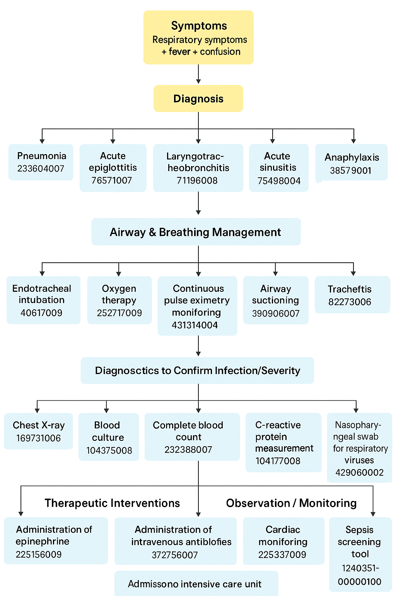

# ChatGPT 5

To help make progress with conversations about AI medical diagnosis, this repository contains my own writeup of my own real medical symptoms when I felt especially unwell. I did the writeup at the start of my real visit to a real doctor at a real hospital.

This page shows an AI medical diagnosis example that uses OpenAI ChatGPT 5.

## AI input prompt

```text
You are an expert medical doctor. You know medical SNOMED CT codes.

Rank the probable medical SNOMED CT codes for diagnosing these symptoms.

This symptom list is in my own words.

Sick for 6 days with significant changes in symptoms over days.

Nose:
- Gold-color mucus at start of illness.
- Runny nose then blocked nose, with lots of postnasal drip, 4 days.
- Blowing nose every few minutes, 4 days.

Skin:
- Fever.
- Soaking sweats.
- Shivering chills.

Lungs:
- Shortness of breath for 5 days; hard to breathe in, hard to breathe deep.
- Pervasive semi-productive cough, every few minutes or so.
- Intermittent stridor, wheezing, whistling breath.

Throat:
- My upper throat and back of my mouth feels like it's burning.
- Yesterday, a sensation that I couldn't breathe in, like the wind knocked out of me. 
- Today, near-instant throat closing.

Strange issues that are wholly different than any of my previous illnesses:
- Total loss of appetite.
- Spasms of internal contractions, like an imploding feeling, pulling inwards.
- Mental confusion for 15 minutes, bad enough that I couldn't understand my wife.
```

## AI output response

Here’s a ranked list of **probable SNOMED CT diagnostic concepts** based on your symptom cluster. I’m prioritizing by likelihood and severity (what would be considered first in an ED or urgent care triage) and using official SNOMED CT descriptors:

---

### **1️⃣ Acute lower respiratory tract infection (LRTI) – Pneumonia or Bronchopneumonia**

* **SNOMED CT:** 233604007 – *Pneumonia*
* **Rationale:** Fever, chills, sweats, productive cough, dyspnea, and mental confusion (esp. in adults) point strongly to pneumonia. Gold-colored mucus could be purulent sputum. Sudden worsening and systemic symptoms (loss of appetite, confusion) align with moderate-severe bacterial pneumonia.
* Alternate code: 233607000 – *Bronchopneumonia*

---

### **2️⃣ Acute epiglottitis / supraglottitis (life-threatening upper airway obstruction)**

* **SNOMED CT:** 76571007 – *Acute epiglottitis*
* **Rationale:** The “burning upper throat,” “near-instant throat closing,” intermittent stridor, and sensation of inability to breathe in are hallmark red flags for epiglottitis/supraglottitis. This is an emergency diagnosis, especially with drooling, dysphagia, or muffled voice (not reported but often present).

---

### **3️⃣ Acute laryngotracheobronchitis (Croup-like illness in adults)**

* **SNOMED CT:** 71186008 – *Laryngotracheobronchitis*
* **Rationale:** Stridor, wheezing, and whistling breath plus cough suggest a combined upper–lower airway inflammation. This may overlap with severe viral illness or bacterial superinfection.

---

### **4️⃣ Acute bacterial sinusitis with systemic involvement**

* **SNOMED CT:** 75498004 – *Acute sinusitis*
* **Rationale:** Gold-colored nasal discharge, heavy postnasal drip, and blocked/runny nose. Could be the origin of a more severe secondary infection but less likely to explain confusion and throat closing alone.

---

### **5️⃣ Sepsis of respiratory origin**

* **SNOMED CT:** 91302008 – *Sepsis* (with lung as source)
* **Rationale:** Confusion, loss of appetite, chills, and systemic collapse sensations indicate possible sepsis. It’s coded separately but is often a complication of pneumonia or epiglottitis.

---

### **6️⃣ Acute allergic reaction with airway compromise (Anaphylaxis)**

* **SNOMED CT:** 39579001 – *Anaphylaxis*
* **Rationale:** Sudden throat closing and stridor can also be anaphylaxis. However, your description is more infectious than allergic — but this must be ruled out in acute care.

---

### **7️⃣ Acute tracheitis / bacterial tracheitis**

* **SNOMED CT:** 82272006 – *Tracheitis*
* **Rationale:** Cough, stridor, and upper airway pain may also reflect bacterial tracheitis, another rare but severe airway infection.

---

### **Summary Table (Ranked)**

| Rank | SNOMED CT Code | Diagnosis Concept        | Why                                                      |
| ---- | -------------- | ------------------------ | -------------------------------------------------------- |
| 1    | 233604007      | Pneumonia                | Core lower respiratory symptoms + fever/chills/confusion |
| 2    | 76571007       | Acute epiglottitis       | Throat burning + near-instant throat closing + stridor   |
| 3    | 71186008       | Laryngotracheobronchitis | Croup-like airway inflammation                           |
| 4    | 75498004       | Acute sinusitis          | Initial nasal symptoms                                   |
| 5    | 91302008       | Sepsis                   | Systemic collapse/mental confusion                       |
| 6    | 39579001       | Anaphylaxis              | Sudden airway compromise differential                    |
| 7    | 82272006       | Tracheitis               | Upper airway bacterial infection                         |

---

**Key clinical point:**
Your constellation of **respiratory distress + stridor + mental confusion** is a **red flag emergency** (epiglottitis, pneumonia with sepsis, or anaphylaxis) — these are conditions where immediate airway protection and IV antibiotics/fluids are typically prioritized.

---

Would you like me to also include the **SNOMED CT procedure codes** that would typically be used in the ED (e.g., airway management, blood cultures, CXR) for such a presentation?
```

Yes.

```
Perfect — here’s a **ranked list of the most likely SNOMED CT **procedure codes** you’d see used in the ED/urgent care for someone with your symptom profile** (airway compromise + fever + confusion + cough).
I’ll group them by urgency and clinical workflow:

---

## **1️⃣ Airway & Breathing Management** (Top priority in ED)

| SNOMED CT Code | Procedure Concept                      | Rationale                                                                                                                            |
| -------------- | -------------------------------------- | ------------------------------------------------------------------------------------------------------------------------------------ |
| **40617009**   | *Endotracheal intubation*              | Definitive airway protection if impending airway obstruction (epiglottitis, anaphylaxis, severe pneumonia with respiratory failure). |
| **232717009**  | *Oxygen therapy*                       | First-line in hypoxia or dyspnea.                                                                                                    |
| **431314004**  | *Continuous pulse oximetry monitoring* | Track O₂ saturation continuously.                                                                                                    |
| **390906007**  | *Airway suctioning*                    | If thick secretions obstruct breathing.                                                                                              |
| **389067003**  | *Nebulized bronchodilator therapy*     | For wheeze/stridor component.                                                                                                        |
| **225158009**  | *Administration of epinephrine*        | If anaphylaxis suspected or airway swelling.                                                                                         |

---

## **2️⃣ Diagnostics to Confirm Infection/Severity**

| SNOMED CT Code | Procedure Concept                             | Rationale                                             |
| -------------- | --------------------------------------------- | ----------------------------------------------------- |
| **168731006**  | *Chest X-ray*                                 | Confirm pneumonia, infiltration, or airway swelling.  |
| **104375008**  | *Blood culture*                               | Sepsis workup prior to IV antibiotics.                |
| **252389007**  | *Complete blood count*                        | Evaluate WBC, neutrophils, sepsis severity.           |
| **104177008**  | *C-reactive protein measurement*              | Marker of infection/inflammation.                     |
| **122456005**  | *Arterial blood gas analysis*                 | Assess oxygenation and ventilation in severe dyspnea. |
| **429060002**  | *Nasopharyngeal swab for respiratory viruses* | Rule out influenza, RSV, COVID, etc.                  |

---

## **3️⃣ Therapeutic Interventions**

| SNOMED CT Code | Procedure Concept                           | Rationale                                                      |
| -------------- | ------------------------------------------- | -------------------------------------------------------------- |
| **225158009**  | *Administration of epinephrine*             | If airway swelling from anaphylaxis or severe supraglottitis.  |
| **372756007**  | *Administration of intravenous antibiotics* | Empiric broad-spectrum antibiotics for pneumonia/epiglottitis. |
| **430193006**  | *IV fluid therapy*                          | Sepsis resuscitation.                                          |
| **18286008**   | *Paracetamol/acetaminophen administration*  | Antipyresis if high fever.                                     |
| **129265001**  | *Admission to intensive care unit*          | If airway or sepsis risk is high.                              |

---

## **4️⃣ Observation / Monitoring**

| SNOMED CT Code       | Procedure Concept             | Rationale                               |
| -------------------- | ----------------------------- | --------------------------------------- |
| **225337009**        | *Cardiac monitoring*          | Severe infection may cause arrhythmias. |
| **390906007**        | *Respiratory rate monitoring* | Track deterioration.                    |
| **1240551000000100** | *Sepsis screening tool*       | Used in ED to stratify sepsis severity. |

---

### **Typical ED Workflow for This Presentation:**

1. **Immediate airway & O₂ support** (intubation/oxygen, pulse oximetry).
2. **Sepsis protocol** — blood cultures, IV antibiotics, IV fluids.
3. **Diagnostic imaging** — chest X-ray ± neck soft tissue X-ray.
4. **Continuous monitoring** — vitals, cardiac, respiratory.
5. **ICU transfer if unstable**.

---

Would you like me to also create a **visual “map” (flowchart)** showing how the probable diagnoses + procedure codes link together (like an ED triage decision tree)?
```

Yes.


